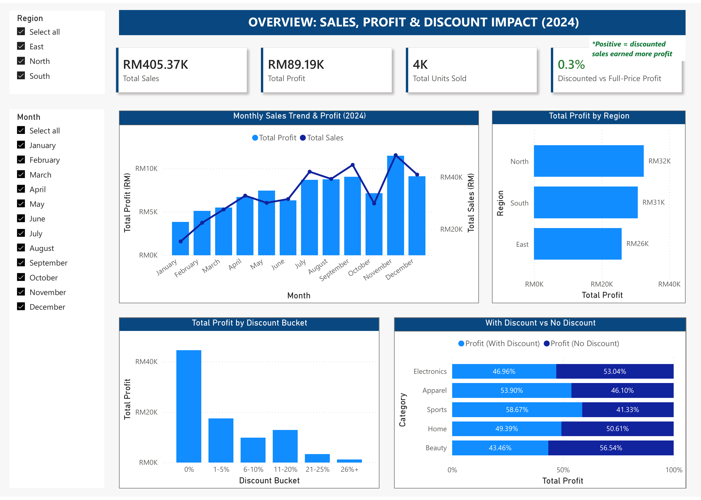
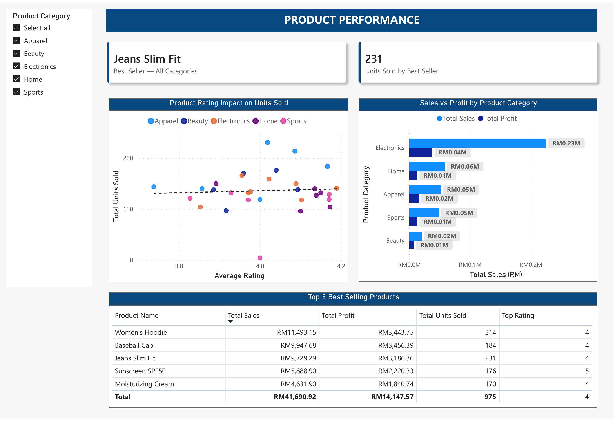
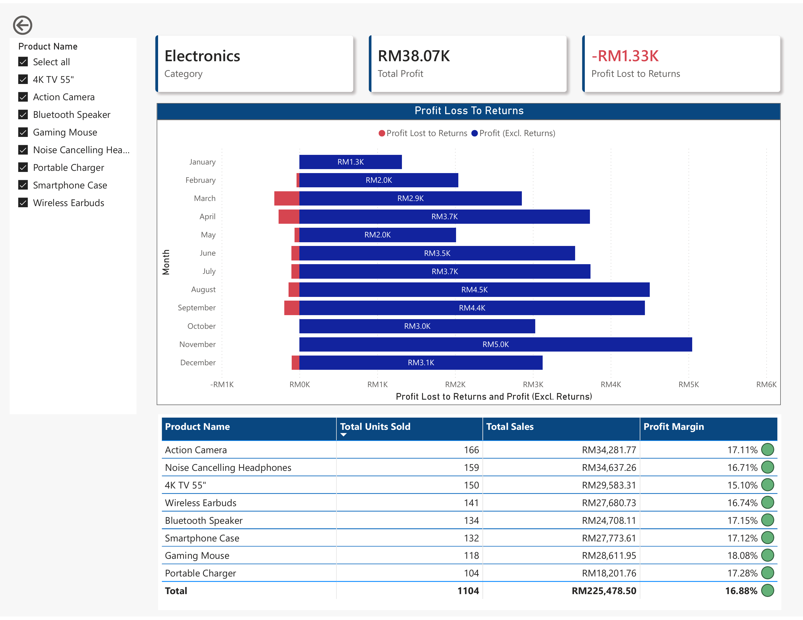
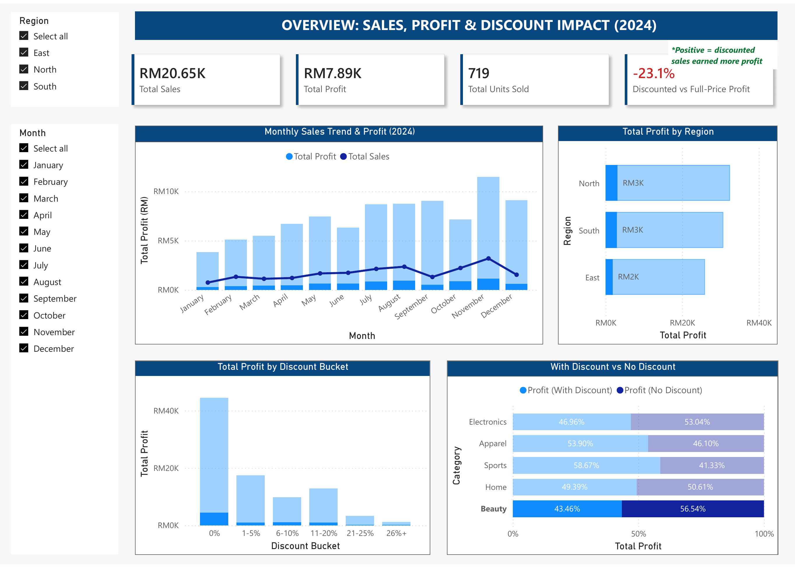
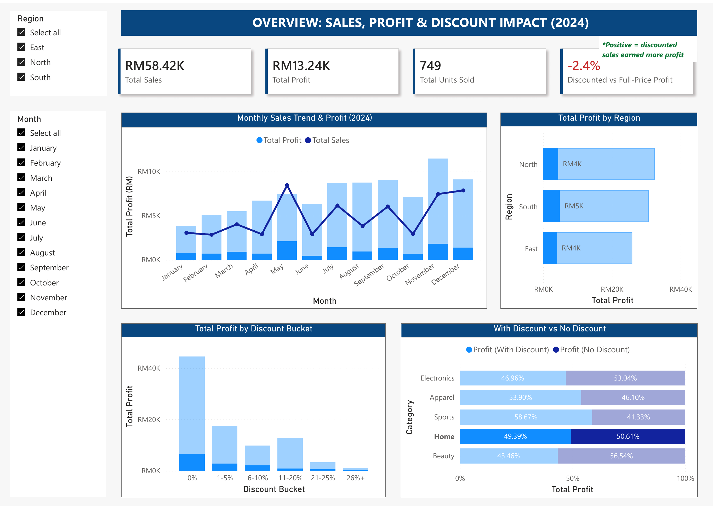
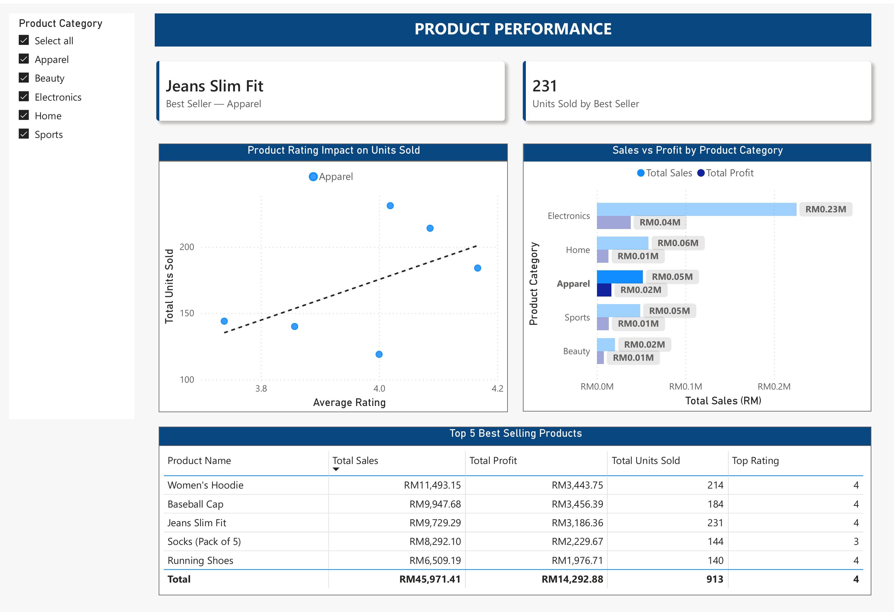
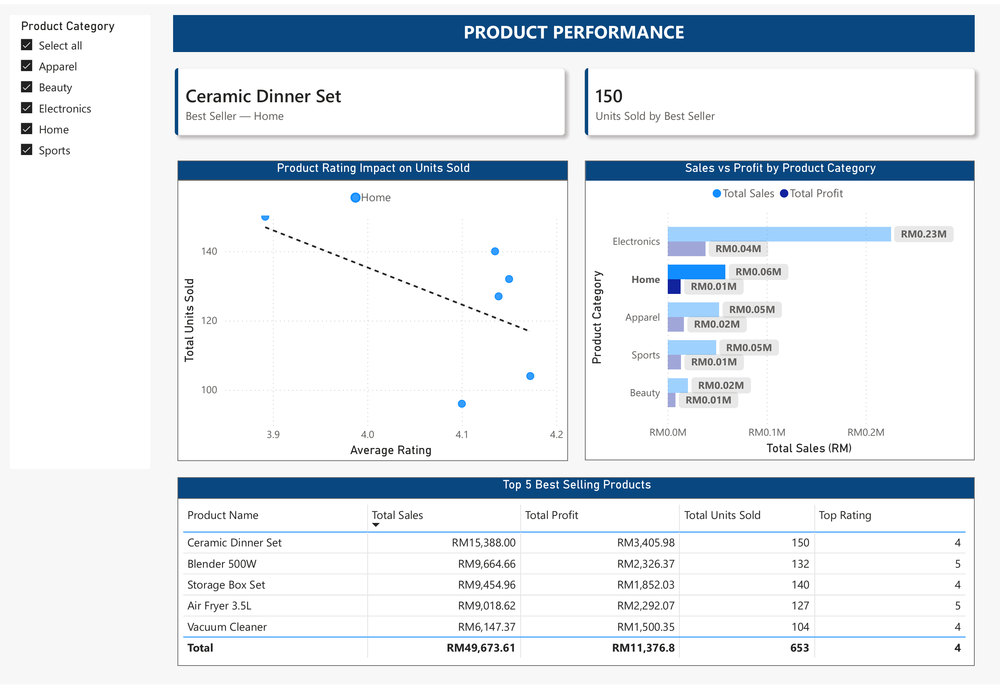

# Sales Performance Analysis (2024) – Power BI

A Power BI report built as the final hands-on assessment of the **Yayasan Peneraju Power BI training programme**. It helps a retail sales team see where profit comes from and what to improve next year.

**2024 at a glance:** RM405K sales · RM89K profit · about 4,000 units sold

📄 **Full report (PDF):** [Sales_Performance_2024.pdf](Sales_Performance_2024.pdf)

## Report pages

**1. Overview:** sales and profit trends, profit by region, and how discounts relate to profit.

**2. Product Performance:** best sellers, sales vs profit by category, and rating vs units sold.

**3. Product Details (drill-through):** right-click a category on Product Performance to see product-level sales, margins and return losses.

## Top insights for the sales team

### 1. Use discounts where they pay off
- **Found:** Overall, discounted and full-price sales earned almost the same profit (0.3% gap), but results differ a lot by category. Discounted sales earned more profit in **Sports (+42%)** and **Apparel (+16.9%)**, but less in **Beauty (−23.1%)** and **Electronics (−11.5%)**. Discounts above **20%** brought in very little profit.
- **Action:** Focus discount campaigns on Sports and Apparel, review discounts in Beauty and Electronics, and keep most discounts at 20% or below.

| Beauty (−23.1%) | Home (−2.4%) |
|---|---|
|  |  |

### 2. Electronics sells the most but keeps the least
- **Found:** Electronics brought in about **RM0.23M** in sales but only about **RM0.04M** profit (about 17% margin). Returns cost another **RM1.3K**, mostly in March–April and August–September.
- **Action:** Find out why Electronics items are returned in those months, and review pricing or supplier costs to improve the margin.

### 3. Plan ahead for November
- **Found:** Sales and profit peaked in **November**, with a dip in **October**.
- **Action:** Build stock and plan campaigns before November, and check what caused the October drop.

### 4. Lift the East region
- **Found:** East earned the least profit (**RM26K**), behind North (RM32K) and South (RM31K).
- **Action:** Apply what works in North and South, such as product mix and promotions, to East.

### 5. Ratings matter for Apparel, not Home
- **Found:** In **Apparel**, higher-rated products sold more. In **Home**, the best seller (Ceramic Dinner Set, 150 units) had the lowest rating.
- **Action:** Promote reviews and top-rated items for Apparel. For Home, focus promotions on price and usefulness. (Each category has only 6–8 products, so treat this as a signal to test.)

| Apparel: higher rating, more units | Home: higher rating, fewer units |
|---|---|
|  |  |

## Skills used

- **Power Query:** cleaned missing values and inconsistent product names
- **DAX:** discount profit gap, profit lost to returns, top-selling product
- **Report design:** KPI cards, slicers, conditional formatting and a drill-through page

## Tools

Power BI Desktop, Power Query, Power BI Service, DAX
